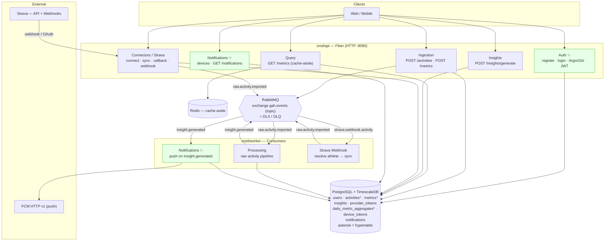
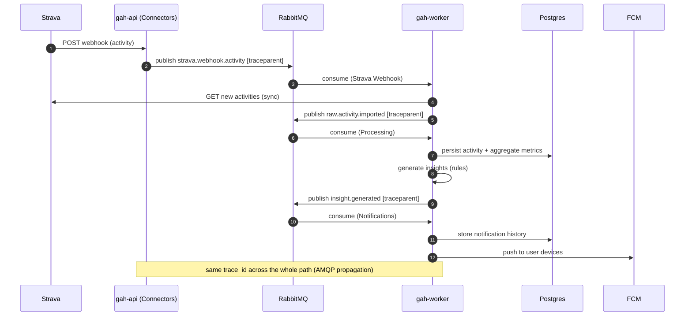
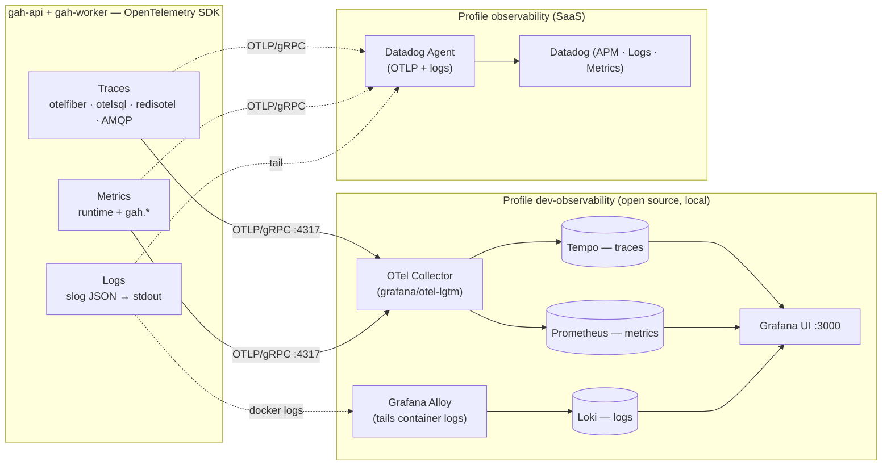

# Architecture — Current State (as-built, after Sprint 2)

This document describes what is **actually implemented today**, after Sprint 2.
It complements [ARCHITECTURE_PLAN.md](ARCHITECTURE_PLAN.md) — which describes the
**phased vision** (MVP → scale/AI) — by showing how Phase 1 was materialized,
including the new modules (authentication, notifications), the asynchronous
processing **worker**, and the **observability** layer.

> Summary of changes since the original plan: added the **Auth** module
> (register/login, Argon2id, JWT), the **Notifications** module (FCM push +
> history), the full **Strava connector** (OAuth + webhook + sync), and an
> **OpenTelemetry observability** layer (traces + metrics + logs) exportable to
> Datadog or to a local OSS stack (Grafana LGTM).

---

## 1. Container view (as-built)

The application is a **modular monolith** with two binaries: the **API** (HTTP,
Fiber) and the **Worker** (RabbitMQ event consumer). Both share the same use
cases and adapters (Clean Architecture) and auto-apply migrations on boot.

✨ = modules/pieces **added in Sprint 2**.

---

## 2. Implemented modules

| Module | Runs in | Responsibility |
|---|---|---|
| **Auth** ✨ | API | Register/login, Argon2id hashing (+pepper), JWT issuing/validation, route-protection middleware. |
| **Ingestion** | API | REST entry for activities and metrics; validates and publishes events. |
| **Query** | API | Metrics read with Redis cache-aside (version-based invalidation). |
| **Insights** | API + Worker | Deterministic rules (HRV, resting HR, sleep, ACWR, recovery). |
| **Connectors / Strava** | API + Worker | OAuth2, token refresh, activity sync, webhook verification/receipt; publishes `raw.activity.imported`. |
| **Processing** | Worker | Pipeline: validation → dedup (idempotency by external_id) → normalization → persistence → daily aggregation → insights → publishes `insight.generated`. |
| **Notifications** ✨ | Worker | Consumes `insight.generated`, sends push (FCM HTTP v1, or LogNotifier fallback) and stores history. Device registration via API. |

---

## 3. Events (RabbitMQ — `gah.events` exchange)

Async messaging over a topic exchange, with per-handler dead-letter
exchange/queues. The body is the `port.Event{Type, Payload}` envelope (JSON) and
the routing key is the `Type`.

| Event (routing key) | Producer | Consumer | Note |
|---|---|---|---|
| `user.registered` | Auth (API) | — | seam for the future (welcome, etc.) |
| `activity.registered` | Ingestion (API) | — | future seam |
| `metric.recorded` | Ingestion (API) | — | future seam |
| `raw.activity.imported` | Connectors / Strava | **Processing** (Worker) | pipeline entry point |
| `insight.generated` | Processing (Worker) | **Notifications** (Worker) | triggers push |
| `strava.webhook.activity` | Strava webhook (API) | **Strava Webhook** (Worker) | resolve athlete → sync |

---

## 4. Distributed flow (Strava → insight → push)

End-to-end example. The **trace context (W3C `traceparent`) is propagated through
the AMQP headers**, so API and Worker share the same `trace_id` — a single
distributed trace crosses the broker.

---

## 5. Observability (new layer) ✨

Both binaries are instrumented with **OpenTelemetry** (vendor-neutral). The app
**only speaks OTLP** — the destination (Datadog or an OSS stack) is a swappable
infra detail, set by config. Everything is *disabled-safe*: with
`OBSERVABILITY_ENABLED=false` the providers are no-ops (no network, no agent).

**Instrumentation:** HTTP via `otelfiber`; Postgres via `XSAM/otelsql`; Redis via
`redisotel`; **AMQP via manual propagation** (inject/extract `traceparent` into
headers → distributed trace). Go runtime metrics + business counters
(`gah.activities.registered`, `gah.metrics.recorded`, `gah.insights.generated`,
`gah.notifications.sent`, histogram `gah.raw_activity.process.duration`).
Structured `slog` JSON logs (stdout) with `trace_id`/`span_id` (OTel) and
`dd.trace_id`/`dd.span_id` (Datadog) for log↔trace correlation.

Operational details and queries in [../observability.md](../observability.md).

---

## 6. Performance / tuning

Synthetic load revealed that, under high concurrency, the bottleneck is
**Postgres connection-pool saturation** (not the queries themselves). The pool is
now **elastic** (`max_open_conns` 50, `max_idle_conns` 25, `conn_max_idle_time`
90s): it grows under load and releases idle connections. Load tool and verdict
live under `manual_tests/sprint_2/` (local; see the sprint README).

---

## 7. Mapping to the phased plan

The as-built is **Phase 1** of the [plan](ARCHITECTURE_PLAN.md) materialized, with
two additions the Phase 1 diagram didn't detail: **Auth** (the foundation for the
relational/professional features in later phases) and **Notifications** (the
"simple push notifications" cited as enough for the MVP). Observability is
cross-cutting and follows the platform across all phases. The evolution points
(Kafka, Cassandra, Realtime, AI/RAG) remain as described in the plan — adapter
swaps behind the same ports.
