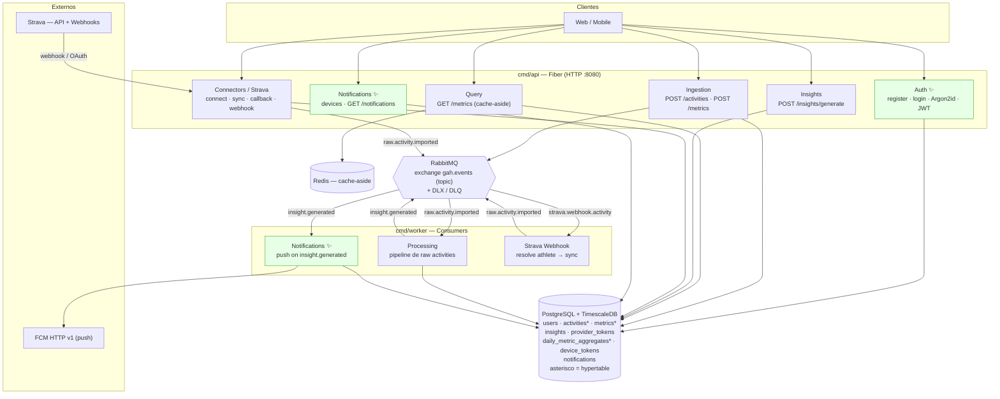
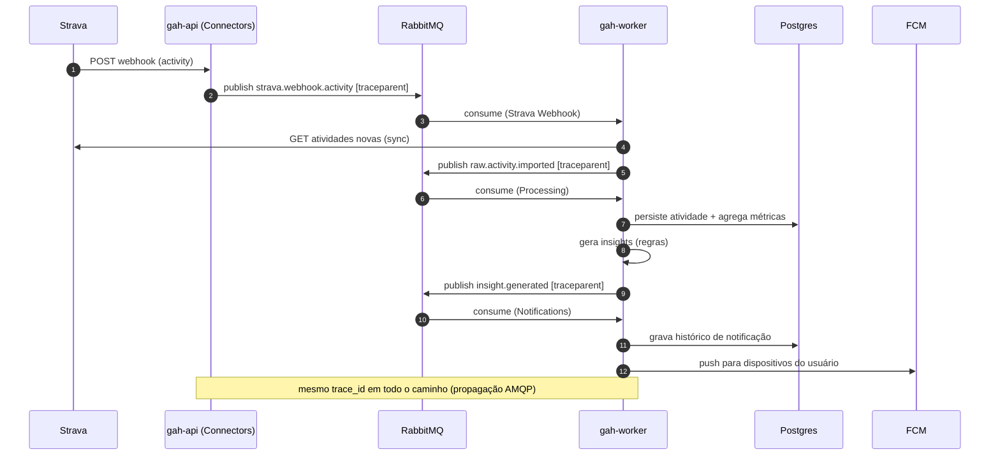
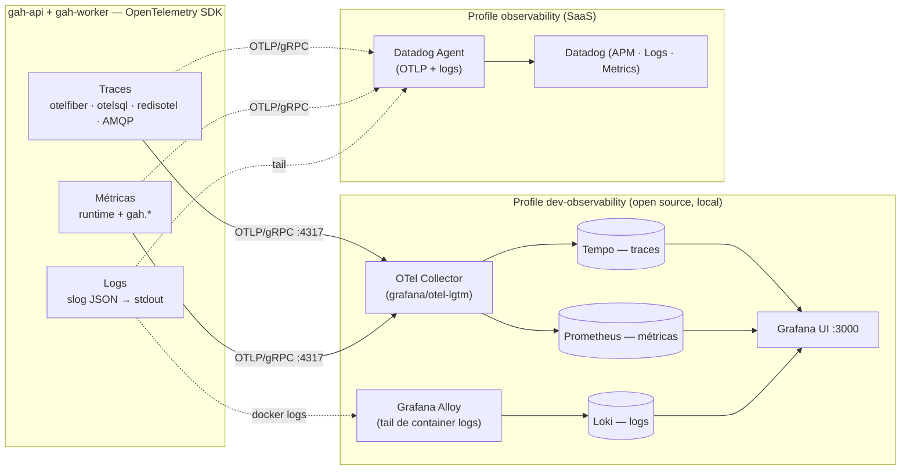

# Arquitetura — Estado Atual (as-built, pós Sprint 2)

Este documento descreve o que está **efetivamente implementado** hoje, após a
Sprint 2. Complementa o [ARCHITECTURE_PLAN_PT.md](ARCHITECTURE_PLAN_PT.md) — que
descreve a **visão por fases** (MVP → escala/IA) — mostrando como a Fase 1 foi
materializada, com os módulos novos (autenticação, notificações), o **worker**
de processamento assíncrono e a camada de **observabilidade**.

> Resumo das mudanças desde o plano original: foram adicionados o módulo de
> **Auth** (register/login, Argon2id, JWT), o módulo de **Notifications** (push
> FCM + histórico), o **conector Strava** completo (OAuth + webhook + sync), e
> uma camada de **observabilidade OpenTelemetry** (traces + métricas + logs)
> exportável para Datadog ou para uma stack OSS local (Grafana LGTM).

---

## 1. Visão de containers (as-built)

A aplicação é um **monolito modular** com dois binários: a **API** (HTTP, Fiber)
e o **Worker** (consumidor de eventos do RabbitMQ). Ambos compartilham os mesmos
use cases e adapters (Clean Architecture) e auto-aplicam as migrations no boot.

✨ = módulos/peças **adicionados na Sprint 2**.

---

## 2. Módulos implementados

| Módulo | Onde roda | Responsabilidade |
|---|---|---|
| **Auth** ✨ | API | Registro/login, hashing Argon2id (+pepper), emissão/validação de JWT, middleware de proteção de rotas. |
| **Ingestion** | API | Entrada REST de atividades e métricas; valida e publica eventos. |
| **Query** | API | Leitura de métricas com cache-aside no Redis (invalidação por versão). |
| **Insights** | API + Worker | Regras determinísticas (HRV, FC repouso, sono, ACWR, recuperação). |
| **Connectors / Strava** | API + Worker | OAuth2, refresh de token, sync de atividades, verificação e recebimento de webhook; publica `raw.activity.imported`. |
| **Processing** | Worker | Pipeline: validação → dedup (idempotência por external_id) → normalização → persistência → agregação diária → insights → publica `insight.generated`. |
| **Notifications** ✨ | Worker | Consome `insight.generated`, dispara push (FCM HTTP v1, ou LogNotifier como fallback) e grava histórico. Registro de dispositivos via API. |

---

## 3. Eventos (RabbitMQ — exchange `gah.events`)

Mensageria por topic exchange, com dead-letter exchange/queues por handler. O
corpo é o envelope `port.Event{Type, Payload}` (JSON) e a routing key é o `Type`.

| Evento (routing key) | Produtor | Consumidor | Observação |
|---|---|---|---|
| `user.registered` | Auth (API) | — | seam para futuro (boas-vindas, etc.) |
| `activity.registered` | Ingestion (API) | — | seam para futuro |
| `metric.recorded` | Ingestion (API) | — | seam para futuro |
| `raw.activity.imported` | Connectors / Strava | **Processing** (Worker) | entrada do pipeline |
| `insight.generated` | Processing (Worker) | **Notifications** (Worker) | dispara push |
| `strava.webhook.activity` | Strava webhook (API) | **Strava Webhook** (Worker) | resolve atleta → sync |

---

## 4. Fluxo distribuído (Strava → insight → push)

Exemplo ponta a ponta. O **contexto de trace (W3C `traceparent`) é propagado
pelos headers AMQP**, então API e Worker compartilham o mesmo `trace_id` — um
único trace distribuído atravessa o broker.

---

## 5. Observabilidade (camada nova) ✨

Os dois binários são instrumentados com **OpenTelemetry** (neutro a fornecedor).
A app **só fala OTLP** — o destino (Datadog ou stack OSS) é um detalhe de infra,
trocável por configuração. Tudo é *disabled-safe*: com `OBSERVABILITY_ENABLED=false`
os providers são no-op (sem rede, sem agent).

**Instrumentação:** HTTP via `otelfiber`; Postgres via `XSAM/otelsql`; Redis via
`redisotel`; **AMQP por propagação manual** (inject/extract de `traceparent` nos
headers → trace distribuído). Métricas de runtime do Go + counters de negócio
(`gah.activities.registered`, `gah.metrics.recorded`, `gah.insights.generated`,
`gah.notifications.sent`, histograma `gah.raw_activity.process.duration`). Logs
estruturados em `slog` JSON (stdout) com `trace_id`/`span_id` (OTel) e
`dd.trace_id`/`dd.span_id` (Datadog) para correlação log↔trace.

Detalhes operacionais e queries em [../observability.md](../observability.md).

---

## 6. Performance / tuning

Carga sintética revelou que, sob alta concorrência, o gargalo é a **saturação do
pool de conexões do Postgres** (não as queries). O pool passou a ser **elástico**
(`max_open_conns` 50, `max_idle_conns` 25, `conn_max_idle_time` 90s): cresce sob
carga e libera conexões ociosas. Ferramenta de carga e veredito em
`manual_tests/sprint_2/` (local; ver README da sprint).

---

## 7. Correspondência com o plano por fases

O as-built é a **Fase 1** do [plano](ARCHITECTURE_PLAN_PT.md) materializada, com
dois acréscimos que o plano não detalhava no diagrama de Fase 1: **Auth** (base
para os recursos profissionais relacionais previstos nas fases seguintes) e
**Notifications** (o "push notifications simples" citado como suficiente para o
MVP). A observabilidade é transversal e acompanha a plataforma em todas as fases.
Os pontos de evolução (Kafka, Cassandra, Realtime, IA/RAG) permanecem como
descrito no plano — trocas de adapter atrás das mesmas ports.
