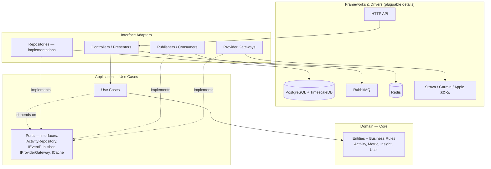
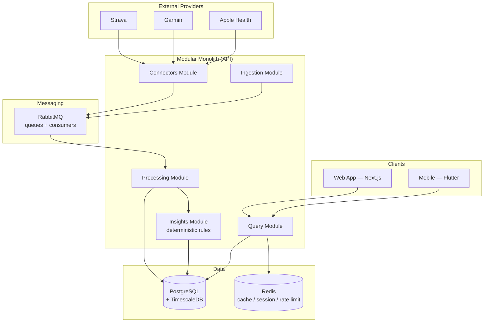
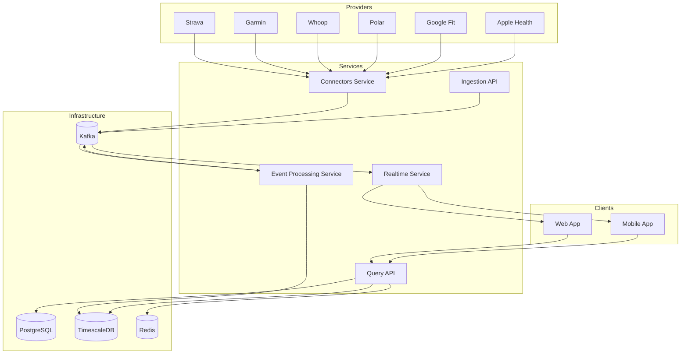
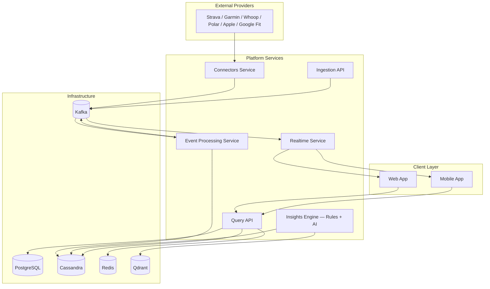

# Architecture Plan — GAH (Growth Athletic Hub)

## 1. Overview

**GAH (Growth Athletic Hub)** is a platform for managing exercise metrics, nutrition, rest and sports performance. The system consolidates data from different platforms, devices and applications into a single environment, allowing users to track their physical evolution and receive actionable insights.

The product serves a spectrum of athletes: from the amateur who simply wants to improve performance, to the professional. The architecture reflects this progression — it starts lean to serve the amateur athlete and is designed to grow incrementally into the distributed platform that supports professional athletes, coaches, teams and organizations.

The central goal of GAH is to transform raw data into actionable knowledge, helping athletes, coaches and health professionals make better decisions.

---

## 2. Architecture Principles

The construction of GAH is guided by a set of principles that apply across all maturity phases of the platform.

**Clean Architecture.** Business rules are the center of the system and have no knowledge of databases, queues, HTTP frameworks or external providers. Every technology is a pluggable detail, accessed through interfaces (ports). This decoupling keeps the highest-value asset — domain logic — testable in isolation and independent of infrastructure choices.

**Phase-based evolution.** The architecture adopts, at each moment, the simplest form that solves the current problem. Each increment of complexity (distributed messaging, dedicated telemetry store, AI layer, microservices) belongs to a later phase. Since all technologies are accessed via ports, each phase transition is an adapter swap, not a rewrite.

**Progressive Event-Driven.** Asynchronous communication between system components is done through messages. In the initial stage this is provided by a lightweight message broker (RabbitMQ); at scale, by an event streaming platform (Kafka).

**Data responsibility separation.** Each database solves the problem it is best suited for. Relational and business data live in PostgreSQL; time series and telemetry live in storage optimized for that access pattern.

**Staged AI-First.** Insight generation is a core platform feature. It starts with deterministic, explainable and low-cost rules, and evolves into an AI layer (RAG + LLM) when data volume and user base justify it.

**Multi-provider.** Integration with external providers is isolated behind its own boundary, so new providers are added without impacting other parts of the system.

---

## 3. Clean Architecture

The application is organized in concentric layers. Dependencies always point inward: outer layers depend on the core, never the other way around. The domain core imports nothing from infrastructure.

**Domain (core).** Pure entities and rules — `Activity`, `Metric`, `Insight`, `User` — and insight logic (HRV drops, training load, sleep quality). No external dependencies; testable without databases, queues or HTTP.

**Application (use cases).** Orchestrates the domain and declares ports (interfaces) for everything external: `IActivityRepository`, `IEventPublisher`, `IProviderGateway`, `ICache`. Use cases talk to interfaces, never to concrete technologies.

**Interface Adapters.** Concrete implementations of the ports: TimescaleDB repository, RabbitMQ publisher, Strava/Garmin gateway, HTTP controllers. This is where technology meets code.

**Frameworks & Drivers.** PostgreSQL/TimescaleDB, RabbitMQ, Redis, provider SDKs and the web framework. Replaceable details.

This structure is what supports phase-based evolution: `IEventPublisher` is implemented by RabbitMQ in the current stage and can be swapped to Kafka at scale; `IActivityRepository` by TimescaleDB today and by Cassandra later. Business rules remain untouched.

---

## 4. Application Structure

In the current stage, the application is a **modular monolith**: a single codebase organized in modules with well-defined logical boundaries, served by an API and accompanied by a worker for asynchronous processing. The modules correspond, in name and responsibility, to the units that can later be extracted as independent services.

Modules and their responsibilities:

| Module | Responsibility |
|---|---|
| **Connectors** | Communication with external platforms: OAuth, token refresh, API consumption, webhook reception and payload normalization. Publishes received data as messages. |
| **Ingestion** | Manual data entry and proprietary integrations: activities, body metrics, nutritional data and rest. Validates and publishes to messaging. |
| **Processing** | Data processing and transformation. Pipeline: validation, deduplication (idempotency by external ID), cross-provider normalization, enrichment, aggregation (daily, weekly, monthly metrics) and persistence. |
| **Insights** | Insight and analysis generation. In the current stage, operates via deterministic rules over metrics. |
| **Query** | Data queries for clients: metrics, activities, history, insights and reports. Serves dashboards, with Redis cache. |

---

## 5. Data Layer

### PostgreSQL — relational and business data

Source of truth for the platform's transactional data: users, authentication, roles and permissions, subscription plans, billing, organizations, coaches, teams, audit logs, integration settings and OAuth tokens. Chosen for transactional consistency, complex relationship support and ease of administrative and user management queries.

### TimescaleDB — time series

PostgreSQL extension dedicated to telemetry and time series: activities, heart rate, sleep metrics, HRV, recovery, nutrition logs, body metrics and aggregated metrics (daily, weekly, monthly). Provides automatic time-based partitioning (hypertables), compression and optimized queries for this access pattern, keeping telemetry in the same relational engine already operated by the platform. Read models are organized by query pattern — for example, activities per user ordered by date, sleep history per user, and aggregated daily metrics.

### Redis — cache

Application cache: dashboards, sessions, API rate limiting and frequently accessed metrics and insights.

---

## 6. Messaging

Asynchronous communication between modules is provided by **RabbitMQ**. It covers webhook ingestion, asynchronous processing, retries, dead-letter queues and idempotency guarantees, decoupling data reception ("receive") from processing ("process") through queues and exchanges.

Since it is accessed through the `IEventPublisher` port, the broker is an infrastructure detail: business rules publish and consume events without knowing the underlying technology.

---

## 7. Insights Layer

Insight generation is central to GAH and built in layers.

The **rules layer** is deterministic, explainable and low-cost, and accounts for most of the perceived value. It operates on the user's metrics and their baseline to detect signals such as significant HRV drops, resting heart rate increases, sleep quality or duration reduction, and training load excess (acute:chronic workload ratio), flagging recovery needs.

The **AI layer** is added on top of the rules layer in later maturity phases, responsible for natural language generation, personalized recommendations and long-term contextual memory, powered by RAG (Retrieval Augmented Generation), LLM integration and vector storage.

The outputs of the insights layer are insights, alerts, reports and recommendations.

---

## 8. Client Applications

### Mobile — Flutter

Application for Android and iOS, with dashboard, insights, activity history, recovery tracking, nutrition logging and notifications.

### Web — Next.js, React, TypeScript

Web application with advanced dashboards, reports, historical analysis, training and nutrition management and administrative portal.

---

## 9. From MVP to Final Product

The architecture is designed to grow in phases, from MVP to the final product. Each phase is a composition of the same foundation — stable domain core, technologies swapped or added as adapters — aligned with the audience the platform comes to serve. Sections 3 through 8 describe the platform in its initial form (Phase 1); this section walks through the complete arc to its full form.

### Phase 1 — MVP: amateur athlete

State described in the previous sections: modular monolith under Clean Architecture, PostgreSQL with TimescaleDB as a single data engine, Redis for cache, RabbitMQ for messaging, insights via deterministic rules and integration with Strava, Garmin and Apple Health. The relational business domain (organizations, coaches, teams, roles, plans) is already modeled in PostgreSQL from here, though fully activated later. Focus on experience consistency, low operational cost and fast iteration.

**What is deliberately excluded from the MVP:** Kafka, Cassandra, Qdrant, RAG/LLM, separate microservices, dedicated Realtime/WebSocket service (simple push notifications suffice), providers beyond Strava/Garmin/Apple Health. All of these belong to later phases, each with the trigger that justifies it.

### Transition triggers

Evolution is not anticipatory — it is reactive. Each component transitions when an observed signal justifies it:

| Observed trigger | Action |
|---|---|
| RabbitMQ hits its ceiling: need for replay/reprocessing, long event retention and many independent consumers at high volume | Introduce **Kafka** in place of (or alongside) RabbitMQ — swap the `IEventPublisher` port implementation |
| Telemetry write volume pressures Postgres even with TimescaleDB; need for multi-region horizontal scaling | Migrate time series to **Cassandra** |
| A module needs to scale/deploy at a different cadence than the others | Extract that module into a **microservice** |
| Users demand live alerts and dashboards | Add **Realtime Service** (WebSockets) consuming events |
| Rule-based insights hit their ceiling; there is enough data for personalization and natural language | Add **AI-powered Insights Engine** (Qdrant + RAG + LLM) |
| Demand for new wearables (Polar, Whoop, Google Fit) | Expand the **Connectors Service** |

### Phase 2 — Decoupling and real-time

The platform begins to support higher user volume, more providers and real-time experiences, serving the advanced amateur athlete and the first continuous monitoring use cases.

**Kafka** takes over as the event backbone, with topics for raw data (`raw.activities`, `raw.sleep`, `raw.nutrition`, `raw.bodymetrics`), processed data (`processed.*`) and business events (`alerts`, `notifications`, `insights`), adding replay, long retention, fault tolerance and multiple independent consumers. Modules under the highest scale pressure — typically Connectors and Event Processing — begin operating as independent services, while the rest remain in the monolith until their own scale trigger appears.

A **Realtime Service**, consuming events from Kafka, provides real-time communication: WebSockets, push notifications, live alerts and continuous dashboard updates. The integration gains new providers (Polar, Whoop, Google Fit), absorbed by the Connectors boundary without impacting other services. Telemetry remains in TimescaleDB during this phase.

### Phase 3 — Final product: distributed scale and AI (professional athlete)

The full form of the platform. Serves professional athletes, coaches, teams and organizations, with real horizontal scale, high availability and AI-first insight generation. System units operate as independent **microservices**, each independently scalable and deployable, communicating asynchronously through Kafka.

**Service catalog for the final product:**

| Service | Responsibility |
|---|---|
| **Connectors Service** | OAuth, token refresh, external API consumption, webhook reception, payload normalization and event publishing. Supports the full set of providers: Strava, Garmin, Polar, Whoop, Apple Health, Google Fit and future integrations. |
| **Ingestion API** | Manual data entry and proprietary integrations (activities, body metrics, nutrition, rest), with validation and event publishing. |
| **Event Processing Service** | Consumes events from Kafka and executes the validation, deduplication, idempotency, cross-provider normalization, enrichment, aggregation and persistence pipeline, publishing derived events. |
| **Insights Engine** | Insight generation, data correlation, pattern and anomaly detection, predictions, recommendations and intelligent reports — combining the rules layer with the AI layer. |
| **Query API** | Queries for metrics, activities, history, insights and reports, serving data to dashboards. |
| **Realtime Service** | WebSockets, push notifications, real-time alerts and dashboard updates, consuming events from Kafka. |

**Storage at scale.** Telemetry migrates to **Cassandra**, optimized for massive writes, low latency, high availability and multi-node horizontal scale, with read models by access pattern (`activities_by_user`, `sleep_by_user`, `daily_metrics_by_user`, `insights_by_user`). **PostgreSQL** remains as source of truth for relational and business data. **Redis** continues as the cache layer. **Qdrant** enters as vector storage: user context, semantic memory, historical insights and knowledge base embeddings.

**AI-powered insights.** On top of the deterministic rules layer, the AI layer is added — RAG, LLM integration and long-term contextual memory — responsible for natural language, personalized recommendations, intelligent reports, anomaly detection and predictions. Qdrant provides the semantic retrieval that feeds the RAG pipeline.

**Professional features.** The relational domain, already modeled in PostgreSQL since the MVP (organizations, coaches, teams, roles and permissions, plans and billing), is fully activated in this phase: athlete management by coach, team-level dashboards and reports, role-based access control and differentiated subscription plans for the professional audience.

---

## 10. Stack by Phase

| Dimension | Phase 1 — Amateur | Phase 2 — Decoupling | Phase 3 — Scale / Professional |
|---|---|---|---|
| Structure | Modular monolith (Clean Architecture) | Partial extraction (monolith + services) | Microservices (Clean Architecture) |
| Messaging | RabbitMQ | Apache Kafka | Apache Kafka |
| Time series | TimescaleDB | TimescaleDB | Cassandra |
| Relational | PostgreSQL | PostgreSQL | PostgreSQL |
| Cache | Redis | Redis | Redis |
| Vector / AI | — | — | Qdrant + RAG + LLM |
| Insights | Deterministic rules | Deterministic rules | Rules + AI |
| Realtime | Push notifications | Realtime Service (WebSockets) | Realtime Service (WebSockets) |
| Providers | Strava, Garmin, Apple Health | + Whoop, Polar, Google Fit | Full provider set |
| Mobile | Flutter | Flutter | Flutter |
| Web | Next.js, React, TypeScript | Next.js, React, TypeScript | Next.js, React, TypeScript |
