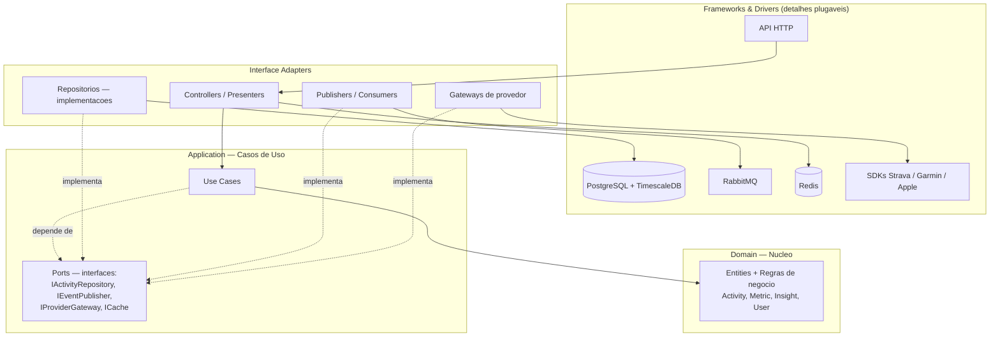
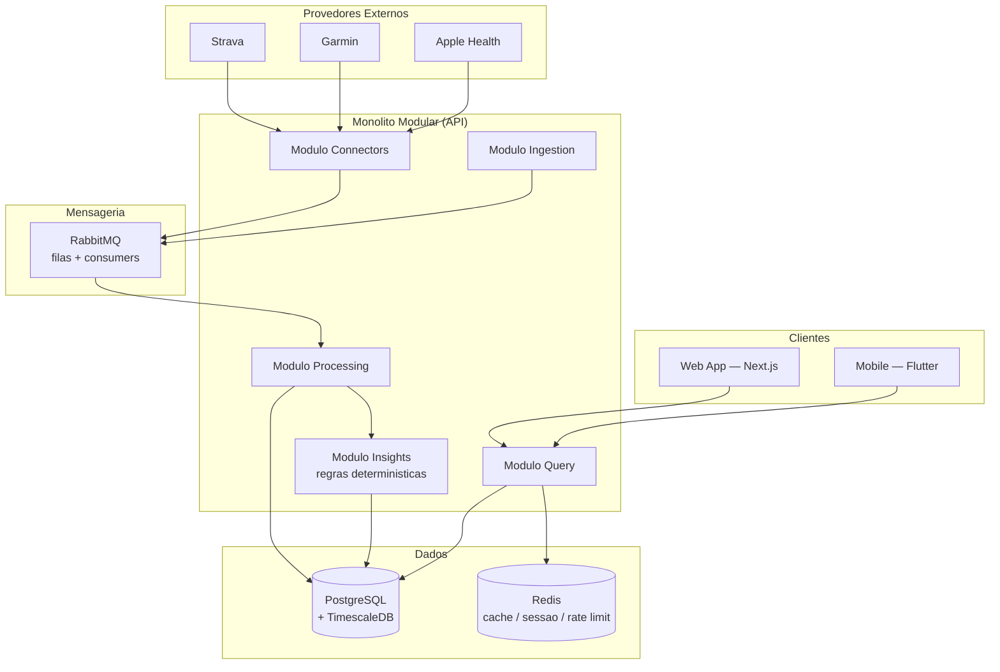
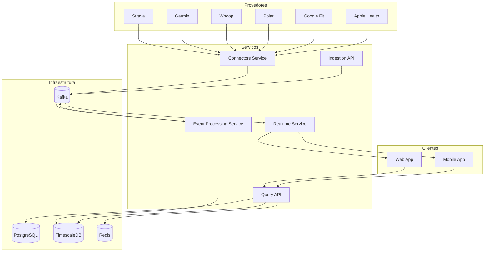
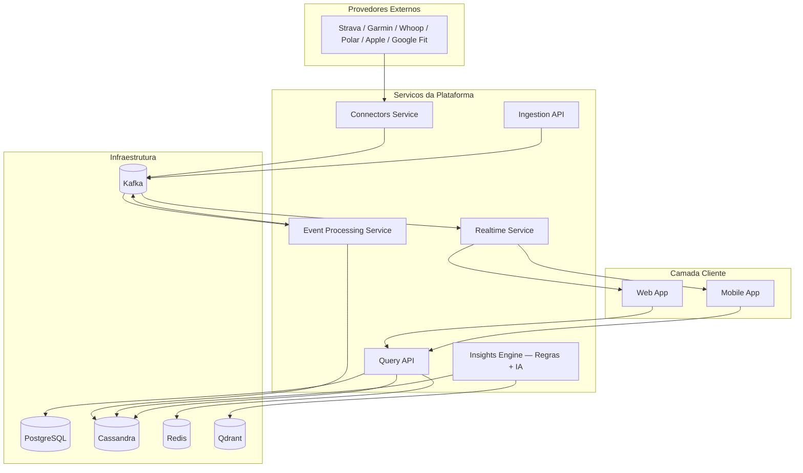

# Plano de Arquitetura — GAH (Growth Athletic Hub)

> **Nota:** este documento é a **visão por fases** (MVP → escala/IA). Para o que
> está **efetivamente implementado hoje** (módulos, eventos e observabilidade
> da Sprint 2), veja [ARCHITECTURE_CURRENT_PT.md](ARCHITECTURE_CURRENT_PT.md).

## 1. Visao Geral

**GAH (Growth Athletic Hub)** e uma plataforma para gerenciamento de metricas de exercicio, alimentacao, descanso e performance esportiva. O sistema consolida dados de diferentes plataformas, dispositivos e aplicacoes num unico ambiente, permitindo que o usuario acompanhe sua evolucao fisica e receba insights acionaveis.

O produto atende um espectro de atletas: do amador, que quer apenas melhorar a performance, ate o profissional. A arquitetura reflete essa progressao — nasce enxuta para servir o atleta amador e e projetada para crescer, de forma incremental, ate a plataforma distribuida que suporta o atleta profissional, treinadores, times e organizacoes.

O objetivo central do GAH e transformar dados brutos em conhecimento acionavel, ajudando atletas, treinadores e profissionais da saude a tomarem melhores decisoes.

---

## 2. Principios de Arquitetura

A construcao do GAH e guiada por um conjunto de principios que valem em todas as fases de maturidade da plataforma.

**Clean Architecture.** A regra de negocio e o centro do sistema e nao conhece banco de dados, fila, framework HTTP ou provedor externo. Toda tecnologia e um detalhe plugavel, acessado atraves de interfaces (ports). Esse desacoplamento mantem o ativo de maior valor — a logica de dominio — testavel em isolamento e independente das escolhas de infraestrutura.

**Evolucao por fases.** A arquitetura adota, a cada momento, a forma mais simples que resolve o problema atual. Cada incremento de complexidade (mensageria distribuida, banco de telemetria dedicado, camada de IA, microsservicos) compoe uma fase posterior. Por serem todas as tecnologias acessadas via ports, cada transicao de fase e a substituicao de um adaptador, nao uma reescrita.

**Event-Driven progressivo.** A comunicacao assincrona entre as partes do sistema e feita por mensagens. No estagio inicial isso e provido por um message broker leve (RabbitMQ); na escala, por uma plataforma de streaming de eventos (Kafka).

**Separacao de responsabilidade de dados.** Cada banco resolve o problema para o qual e melhor. Dados relacionais e de negocio vivem no PostgreSQL; series temporais e telemetria vivem em armazenamento otimizado para esse padrao.

**AI-First por etapas.** A geracao de insights e funcionalidade central da plataforma. Ela comeca por regras deterministicas, explicaveis e baratas, e evolui para uma camada de IA (RAG + LLM) quando ha volume de dados e usuarios que a justifiquem.

**Multi-provider.** A integracao com provedores externos e isolada numa fronteira propria, de modo que novos provedores sao adicionados sem impacto nas demais partes do sistema.

---

## 3. Clean Architecture

A aplicacao e organizada em camadas concentricas. A dependencia aponta sempre para dentro: as camadas externas dependem do nucleo, nunca o contrario. O nucleo de dominio nao importa nada de infraestrutura.

**Domain (nucleo).** Entidades e regras puras — `Activity`, `Metric`, `Insight`, `User` — e a logica de insights (queda de HRV, carga de treino, qualidade de sono). Sem dependencias externas; testavel sem banco, fila ou HTTP.

**Application (casos de uso).** Orquestra o dominio e declara as ports (interfaces) para tudo que e externo: `IActivityRepository`, `IEventPublisher`, `IProviderGateway`, `ICache`. Os casos de uso falam com interfaces, nunca com tecnologias concretas.

**Interface Adapters.** Implementacoes concretas das ports: repositorio sobre TimescaleDB, publisher sobre RabbitMQ, gateway de Strava/Garmin, controllers HTTP. E onde a tecnologia encosta no codigo.

**Frameworks & Drivers.** PostgreSQL/TimescaleDB, RabbitMQ, Redis, SDKs de provedor e o framework web. Detalhes substituiveis.

Essa estrutura e o que da sustentacao a evolucao por fases: `IEventPublisher` e implementado por RabbitMQ no estagio atual e pode ser por Kafka na escala; `IActivityRepository` por TimescaleDB hoje e por Cassandra adiante. A regra de negocio permanece intocada.

---

## 4. Estrutura da Aplicacao

No estagio atual, a aplicacao e um **monolito modular**: uma base de codigo unica, organizada em modulos com fronteiras logicas bem definidas, servida por uma API e acompanhada de um worker para processamento assincrono. Os modulos correspondem, em nome e responsabilidade, as unidades que podem futuramente ser extraidas como servicos independentes.

Os modulos e suas responsabilidades:

| Modulo | Responsabilidade |
|---|---|
| **Connectors** | Comunicacao com plataformas externas: OAuth, refresh de tokens, consumo de APIs, recebimento de webhooks e normalizacao de payloads. Publica os dados recebidos como mensagens. |
| **Ingestion** | Entrada de dados manuais ou de integracoes proprias: atividades, metricas corporais, dados nutricionais e de descanso. Valida e publica na mensageria. |
| **Processing** | Processamento e transformacao dos dados recebidos. Pipeline: validacao, deduplicacao (idempotencia por ID externo), normalizacao entre provedores, enriquecimento, agregacao (metricas diarias, semanais, mensais) e persistencia. |
| **Insights** | Geracao de insights e analises. No estagio atual, opera por regras deterministicas sobre as metricas. |
| **Query** | Consulta de dados para os clientes: metricas, atividades, historicos, insights e relatorios. Serve os dashboards, com cache em Redis. |

---

## 5. Camada de Dados

### PostgreSQL — dados relacionais e de negocio

Fonte de verdade dos dados transacionais da plataforma: usuarios, autenticacao, papeis e permissoes, planos de assinatura, billing, organizacoes, treinadores, times, audit logs, configuracoes de integracao e tokens OAuth. Escolhido pela consistencia transacional, suporte a relacionamentos complexos e facilidade para consultas administrativas e de gestao de usuarios.

### TimescaleDB — series temporais

Extensao do PostgreSQL dedicada a telemetria e series temporais: atividades, frequencia cardiaca, metricas de sono, HRV, recuperacao, logs de nutricao, metricas corporais e metricas agregadas (diarias, semanais, mensais). Prove particionamento automatico por tempo (hypertables), compressao e queries otimizadas para esse padrao de acesso, mantendo a telemetria no mesmo motor relacional ja operado pela plataforma. Read models sao organizados por padrao de consulta — por exemplo, atividades por usuario ordenadas por data, historico de sono por usuario e metricas diarias agregadas.

### Redis — cache

Cache da aplicacao: dashboards, sessoes, rate limiting de API e metricas e insights acessados com frequencia.

---

## 6. Mensageria

A comunicacao assincrona entre os modulos e provida pelo **RabbitMQ**. Ele cobre a ingestao de webhooks, o processamento assincrono, retries, dead-letter queues e a garantia de idempotencia, desacoplando a recepcao dos dados ("receber") do seu processamento ("processar") por meio de filas e exchanges.

Por ser acessado atraves da port `IEventPublisher`, o broker e um detalhe de infraestrutura: a regra de negocio publica e consome eventos sem conhecer a tecnologia subjacente.

---

## 7. Camada de Insights

A geracao de insights e central no GAH e construida em camadas.

A **camada de regras** e deterministica, explicavel e barata, e responde pela maior parte do valor percebido. Opera sobre as metricas do usuario e sua baseline para detectar sinais como queda relevante de HRV, aumento da frequencia cardiaca em repouso, reducao da qualidade ou duracao do sono e excesso de carga de treino (acute:chronic workload ratio), sinalizando necessidade de recuperacao.

A **camada de IA** soma-se a de regras nas fases de maior maturidade da plataforma, responsavel pela geracao de linguagem natural, recomendacoes personalizadas e memoria contextual de longo prazo, apoiada em RAG (Retrieval Augmented Generation), integracao com LLM e armazenamento vetorial.

Os outputs da camada de insights sao insights, alertas, relatorios e recomendacoes.

---

## 8. Aplicacoes Cliente

### Mobile — Flutter

Aplicativo para Android e iOS, com dashboard, insights, historico de atividades, acompanhamento de recuperacao, registro de nutricao e notificacoes.

### Web — Next.js, React, TypeScript

Aplicacao web com dashboards avancados, relatorios, analise historica, gestao de treino e nutricao e portal administrativo.

---

## 9. Do MVP ao Produto Final

A arquitetura e projetada para crescer em fases, do MVP ate o produto final. Cada fase e uma composicao da mesma base — nucleo de dominio estavel, tecnologias trocadas ou somadas como adaptadores — alinhada ao publico que a plataforma passa a atender. As secoes 3 a 8 descrevem a plataforma em sua forma inicial (Fase 1); esta secao percorre o arco completo ate a forma plena.

### Fase 1 — MVP: atleta amador

Estado descrito nas secoes anteriores: monolito modular sob Clean Architecture, PostgreSQL com TimescaleDB num unico motor de dados, Redis para cache, RabbitMQ para mensageria, insights por regras deterministicas e integracao com Strava, Garmin e Apple Health. O dominio relacional de negocio (organizacoes, treinadores, times, papeis, planos) ja e modelado no PostgreSQL desde aqui, ainda que plenamente ativado mais adiante. Foco em consistencia da experiencia, baixo custo operacional e iteracao rapida.

**O que fica deliberadamente fora do MVP:** Kafka, Cassandra, Qdrant, RAG/LLM, microsservicos separados, servico dedicado de Realtime/WebSocket (push notifications simples bastam), provedores alem de Strava/Garmin/Apple Health. Tudo isso pertence a fases posteriores, cada um com o gatilho que o justifica.

### Gatilhos de transicao

A evolucao nao e antecipada — e reativa. Cada componente transiciona quando um sinal observado o justifica:

| Gatilho observado | Acao |
|---|---|
| RabbitMQ atinge o teto: necessidade de replay/reprocessamento, retencao longa de eventos e muitos consumidores independentes em alto volume | Introduzir **Kafka** no lugar (ou ao lado) do RabbitMQ — troca da implementacao da port `IEventPublisher` |
| Volume de escrita de telemetria pressiona o Postgres mesmo com TimescaleDB; necessidade de escala horizontal multi-regiao | Migrar series temporais para **Cassandra** |
| Um modulo precisa escalar/deployar em ritmo diferente dos outros | Extrair esse modulo para **microsservico** |
| Usuarios pedem alertas e dashboards ao vivo | Adicionar **Realtime Service** (WebSockets) consumindo eventos |
| Insights por regra atingem o teto; ha dados suficientes para personalizacao e linguagem natural | Adicionar **Insights Engine com IA** (Qdrant + RAG + LLM) |
| Demanda por novos wearables (Polar, Whoop, Google Fit) | Expandir o **Connectors Service** |

### Fase 2 — Desacoplamento e tempo real

A plataforma passa a suportar maior volume de usuarios, mais provedores e experiencias em tempo real, servindo o atleta amador avancado e os primeiros casos de uso de acompanhamento continuo.

O **Kafka** assume como espinha dorsal de eventos, com topicos para dados brutos (`raw.activities`, `raw.sleep`, `raw.nutrition`, `raw.bodymetrics`), dados processados (`processed.*`) e eventos de negocio (`alerts`, `notifications`, `insights`), adicionando replay, retencao longa, tolerancia a falhas e multiplos consumidores independentes. Os modulos sob maior pressao de escala — tipicamente Connectors e Event Processing — passam a operar como servicos independentes, enquanto os demais permanecem no monolito ate que seu proprio gatilho de escala apareca.

Um **Realtime Service**, consumindo eventos do Kafka, prove comunicacao em tempo real: WebSockets, push notifications, alertas ao vivo e atualizacao continua dos dashboards. A integracao ganha novos provedores (Polar, Whoop, Google Fit), absorvidos pela fronteira do Connectors sem impacto nos demais servicos. A telemetria permanece em TimescaleDB nesta fase.

### Fase 3 — Produto final: escala distribuida e IA (atleta profissional)

A forma plena da plataforma. Atende o atleta profissional, treinadores, times e organizacoes, com escala horizontal real, alta disponibilidade e geracao de insights IA-first. As unidades do sistema operam como **microsservicos** independentes, cada um escalavel e implantavel isoladamente, comunicando-se de forma assincrona pelo Kafka.

**Catalogo de servicos do produto final:**

| Servico | Responsabilidade |
|---|---|
| **Connectors Service** | OAuth, refresh de tokens, consumo de APIs externas, recebimento de webhooks, normalizacao de payloads e publicacao de eventos. Suporta o conjunto completo de provedores: Strava, Garmin, Polar, Whoop, Apple Health, Google Fit e integracoes futuras. |
| **Ingestion API** | Entrada de dados manuais e de integracoes proprias (atividades, metricas corporais, nutricao, descanso), com validacao e publicacao de eventos. |
| **Event Processing Service** | Consome eventos do Kafka e executa o pipeline de validacao, deduplicacao, idempotencia, normalizacao entre provedores, enriquecimento, agregacao e persistencia, publicando eventos derivados. |
| **Insights Engine** | Geracao de insights, correlacao de dados, deteccao de padroes e anomalias, predicoes, recomendacoes e relatorios inteligentes — combinando a camada de regras com a camada de IA. |
| **Query API** | Consulta de metricas, atividades, historicos, insights e relatorios, disponibilizando dados para os dashboards. |
| **Realtime Service** | WebSockets, push notifications, alertas em tempo real e atualizacao de dashboards, consumindo eventos do Kafka. |

**Armazenamento na escala.** A telemetria migra para **Cassandra**, otimizada para escrita massiva, baixa latencia, alta disponibilidade e escala horizontal multi-no, com read models por padrao de acesso (`activities_by_user`, `sleep_by_user`, `daily_metrics_by_user`, `insights_by_user`). O **PostgreSQL** permanece como fonte de verdade dos dados relacionais e de negocio. O **Redis** segue como camada de cache. O **Qdrant** entra como armazenamento vetorial: contexto do usuario, memoria semantica, insights historicos e embeddings da base de conhecimento.

**Insights com IA.** Sobre a camada de regras deterministicas soma-se a camada de IA — RAG, integracao com LLM e memoria contextual de longo prazo — responsavel por linguagem natural, recomendacoes personalizadas, relatorios inteligentes, deteccao de anomalias e predicoes. O Qdrant prove a recuperacao semantica que alimenta o pipeline RAG.

**Recursos profissionais.** O dominio relacional, ja modelado no PostgreSQL desde o MVP (organizacoes, treinadores, times, papeis e permissoes, planos e billing), e plenamente ativado nesta fase: gestao de atletas por treinador, dashboards e relatorios em nivel de equipe, controle de acesso por papel e planos de assinatura diferenciados para o publico profissional.

---

## 10. Stack por Fase

| Dimensao | Fase 1 — Amador | Fase 2 — Desacoplamento | Fase 3 — Escala / Profissional |
|---|---|---|---|
| Estrutura | Monolito modular (Clean Architecture) | Extracao parcial (monolito + servicos) | Microsservicos (Clean Architecture) |
| Mensageria | RabbitMQ | Apache Kafka | Apache Kafka |
| Series temporais | TimescaleDB | TimescaleDB | Cassandra |
| Relacional | PostgreSQL | PostgreSQL | PostgreSQL |
| Cache | Redis | Redis | Redis |
| Vetorial / IA | — | — | Qdrant + RAG + LLM |
| Insights | Regras deterministicas | Regras deterministicas | Regras + IA |
| Realtime | Push notifications | Realtime Service (WebSockets) | Realtime Service (WebSockets) |
| Provedores | Strava, Garmin, Apple Health | + Whoop, Polar, Google Fit | Conjunto completo |
| Mobile | Flutter | Flutter | Flutter |
| Web | Next.js, React, TypeScript | Next.js, React, TypeScript | Next.js, React, TypeScript |
